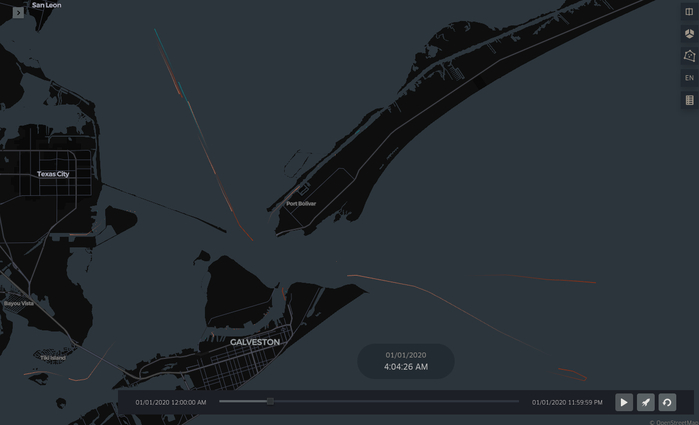

Kepler.gl demo
===

Uses [Moving Features JSON](https://docs.ogc.org/is/19-045r3/19-045r3.html) (MF-JSON) from [MobilityDB's](https://mobilitydb.com/) [_libmeos_](https://www.libmeos.com/) as a datasource for the [Kepler.gl](https://kepler.gl/) Trip Layer

## Demo

Deployed to GitHub Pages

1. [Small json](https://jw3.github.io/example-kepler.gl?f=kgl-1000-500.json) ~1000 tracks
2. [Medium json](https://jw3.github.io/example-kepler.gl?f=kgl-3731-500.json) ~3700 tracks
3. [Large json](https://jw3.github.io/example-kepler.gl?f=kgl-9146-250.json) ~9000 tracks

The default pages url, without a query param, loads the 1k dataset.

The simulation runs on the GPU with WebGL, the larger datasets may not like a smaller GPU.

The track color rendered in the demo is determined by the vessel type id.

## Future

Kepler.gl has limited support for GeoArrow datasets. It would be interesting to compare performance against the geojson.

The limited support is for the [Polygon Layer](https://docs.kepler.gl/docs/user-guides/b-kepler-gl-workflow/a-add-data-to-the-map#geoarrow) alone, so it would take some unknown amount of work to enable support for the Trip Layer used in this demo.

## Reference

- https://kepler.gl/
- https://deck.gl/
- https://mobilitydb.com/
- https://www.libmeos.com/
- https://docs.ogc.org/is/19-045r3/19-045r3.html
- https://docs.kepler.gl/docs/user-guides/c-types-of-layers/k-trip
